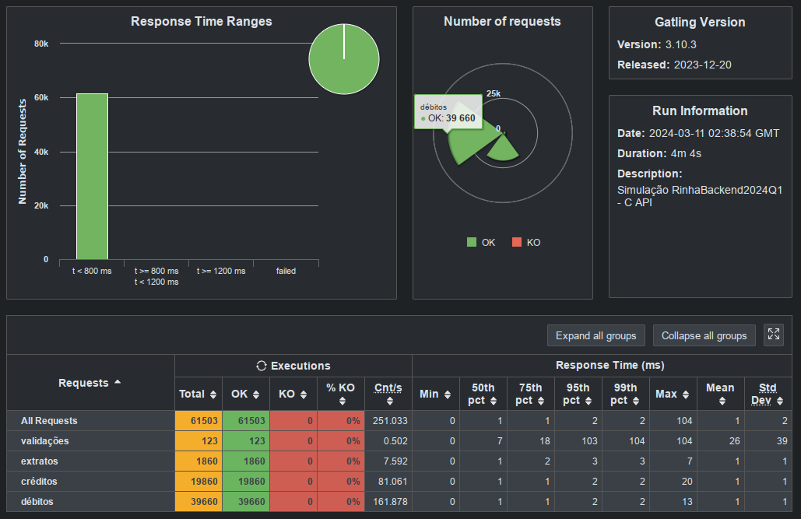

# Resultados

# Timeline
- [Resultados](#resultados)
- [Timeline](#timeline)
  - [Teste](#teste)
    - [Tweak db (Versão entregue)](#tweak-db-versão-entregue)
    - [Threads and conns to 20](#threads-and-conns-to-20)
    - [Threads and conns to 5](#threads-and-conns-to-5)
    - [Db tweak](#db-tweak)
    - [Validações passing](#validações-passing)
    - [Base test](#base-test)

## Teste 

### Tweak db (Versão entregue)

```sql
shared_buffers = 75MB
effective_cache_size = 225MB
maintenance_work_mem = 19200kB
checkpoint_completion_target = 0.9
wal_buffers = 2304kB
default_statistics_target = 100
random_page_cost = 1.1
effective_io_concurrency = 200
work_mem = 1920kB
huge_pages = off
min_wal_size = 1GB
max_wal_size = 4GB
```



### Threads and conns to 20


### Threads and conns to 5


### Db tweak

fsync = 0
UNLOGGED TABLE
Pg tune

```ini
shared_buffers = 64000kB
effective_cache_size = 192000kB
maintenance_work_mem = 16000kB
checkpoint_completion_target = 0.9
wal_buffers = 1920kB
default_statistics_target = 100
random_page_cost = 1.1
effective_io_concurrency = 200
work_mem = 1600kB
```


### Validações passing

Vamo q vamo!


### Base test

Tamo bem de primeira! 

Erros de validação.


